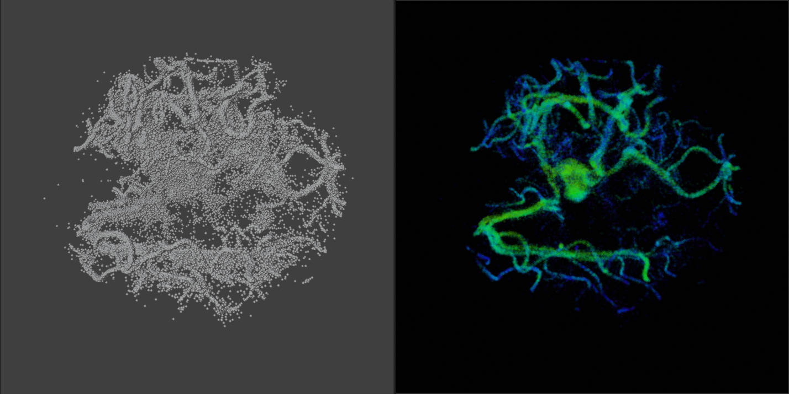
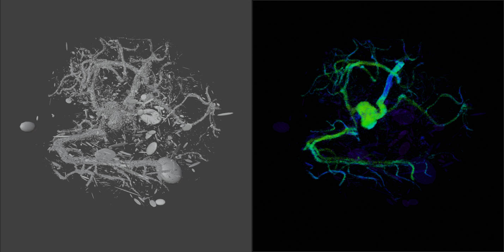

# Blender XRay 3DGS Viewer Node | Blender X 射线高斯点云可视化节点

A Geometry Node setup in **Blender** for visualizing **3D Gaussian Splatting (3DGS)** point cloud data in **medical** and **industrial imaging** contexts, with an X-ray–style rendering aesthetic.

基于 **Blender** 的几何节点扩展，用于在**医学**或**工业成像**场景中可视化 **3D Gaussian Splatting (3DGS)** 点云数据，支持 X 光风格渲染。

> Inspired by the [Mediastorm Blender 3DGS/4DGS Node Project](https://github.com/mediastormDev/Blender-3DGS-4DGS-Viewer-Node)  
> 灵感来源于 [影视飓风团队的 3DGS/4DGS 节点项目](https://github.com/mediastormDev/Blender-3DGS-4DGS-Viewer-Node)

---

## 🔍 Use Cases | 应用场景

- Medical point cloud data visualization (e.g. vascular structures, organs)
- Rapid development of 3D visualization pipelines via Blender Nodes

- 医学影像 3DGS 点云可视化（如动脉、器官结构）
- 基于 Blender 节点系统快速开发 3D 点云可视化流程

---

## 🚀 Features | 功能特点

- ✅ Load `.ply` files with 3DGS attributes: position, color, rotation, scale, opacity
- ✅ Real-time preview via Blender Geometry Nodes – no external plugins needed
- ✅ Customizable visual controls for scale, orientation, transparency
- ✅ Optional X-ray-style material rendering
- ✅ Easily integratable into medical/industrial pipelines

- ✅ 支持加载包含位置、颜色、旋转、缩放、透明度等属性的 `.ply` 格式 3DGS 数据
- ✅ 基于 Blender Geometry Node 实时可视化，无需外部插件
- ✅ 可调节点大小、方向、透明度等可视参数
- ✅ 提供简洁的 X 光风格着色方案
- ✅ 可扩展集成进医学或工业图像工作流

---

## 🔧 How to Use | 使用方法

1. Clone or download this repository
2. Open in **Blender 4.2 or later**
3. Append the `NodeTree` or open `xray.blend` directly
4. Insert the node group into your scene
5. Load your 3DGS `.ply` file and adjust material properties as needed

1. 克隆或下载本仓库
2. 使用 **Blender 4.2 或更高版本** 打开
3. 追加几何节点组或直接打开 `xray.blend`
4. 将节点组插入你的场景中
5. 加载 3DGS `.ply` 数据，并根据需要调整材质参数

---

## 📁 File Structure | 文件说明

- `xray.blend` – Includes usable node group and sample `.ply` data (e.g., aneurism with 2000 iteration)
- `images/` – Contains rendered preview images

- `xray.blend` – 包含几何节点组与示例 `.ply` 数据（动脉瘤的2k轮迭代结果）
- `images/` – 渲染效果图文件夹

---

## ⚠️ Notes | 注意事项

- Dense point clouds may affect real-time performance in Blender. Consider downsampling large datasets for better interactivity.
- 点云数据量较大时，可能会导致 Blender 卡顿。建议在可接受范围内进行采样处理。

---

## 📷 Previews | 效果预览

### 🔹 Point Cloud Preview | 点云可视化

### 🔹 Gaussian Sphere Preview | 高斯球可视化

---

## 📄 License | 许可协议

This project is licensed under the MIT License.  
本项目采用 MIT 开源协议发布。

---

## 🙋 Contact & Feedback | 联系与反馈

For questions, suggestions, or collaboration:  
如需帮助、提出建议或技术交流：

- GitHub Issues  
- [Bilibili | 哔哩哔哩主页](https://space.bilibili.com/349903711)

欢迎点赞、收藏与分享！

